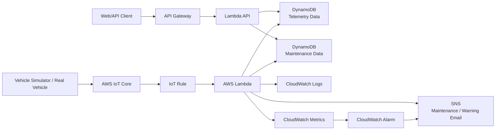

# Bản hoàn thiện đề tài: Smart Vehicle Management System on AWS IoT

## 1. Chốt đề tài

**Tên đề tài tiếng Anh:**  
**Smart Vehicle Management System on AWS IoT**

**Tên đề tài tiếng Việt:**  
**Hệ thống quản lý xe thông minh trên AWS IoT**

Đây là dự án kết hợp giữa hai hướng:

- **Giám sát xe:** thu thập dữ liệu vận hành như tốc độ, nhiệt độ động cơ, số km đã chạy.
- **Nhắc lịch bảo dưỡng:** tự động cảnh báo khi xe đạt mốc cần bảo dưỡng.

Kiến trúc chính sử dụng **AWS IoT Core** để nhận dữ liệu từ xe hoặc thiết bị mô phỏng xe. Đây là hướng sát thực tế hơn vì xe thật thường gửi dữ liệu qua mô hình IoT/MQTT thay vì gọi API HTTP thông thường.

## 2. Lý do chọn đề tài

Nhu cầu sử dụng ô tô, xe cá nhân, xe giao hàng và xe dịch vụ ngày càng phổ biến. Khi số lượng xe tăng, việc theo dõi tình trạng xe thủ công dễ gặp nhiều vấn đề:

- Chủ xe dễ quên lịch bảo dưỡng định kỳ.
- Doanh nghiệp nhỏ khó theo dõi tình trạng từng xe.
- Xe chạy quá tốc độ có thể gây mất an toàn.
- Động cơ quá nóng có thể dẫn đến hư hỏng.
- Dữ liệu vận hành không được lưu lại để kiểm tra.
- Không có cảnh báo tự động khi xe có dấu hiệu bất thường.

Vì vậy, đề tài này có tính thực tế cao, phù hợp với xu hướng IoT, cloud và quản lý phương tiện thông minh.

## 3. Bài toán cần giải quyết

Bài toán của dự án:

> Làm thế nào để xây dựng một hệ thống cloud có thể nhận dữ liệu xe theo thời gian gần thực, xử lý dữ liệu, lưu trữ, ghi log, đo lường và gửi cảnh báo khi xe có dấu hiệu bất thường hoặc đến hạn bảo dưỡng?

Trong phiên bản workshop, hệ thống sử dụng **Vehicle Simulator** để mô phỏng dữ liệu xe. Trong thực tế, simulator có thể được thay bằng thiết bị gắn trên xe thật như OBD-II reader, CAN bus gateway, Raspberry Pi, ESP32 hoặc thiết bị telematics.

## 4. Mục tiêu dự án

Sau khi hoàn thành, hệ thống cần đạt được các mục tiêu sau:

- Xe mô phỏng gửi dữ liệu lên AWS IoT Core.
- IoT Rule chuyển dữ liệu đến AWS Lambda.
- Lambda xử lý dữ liệu telemetry.
- Dữ liệu vận hành được lưu vào DynamoDB.
- Dữ liệu bảo dưỡng được lưu hoặc cập nhật trong DynamoDB.
- CloudWatch ghi log và hỗ trợ theo dõi hệ thống.
- CloudWatch Metric/Alarm hỗ trợ phát hiện tình trạng cảnh báo.
- SNS gửi email khi xe quá tốc độ, quá nhiệt hoặc đến hạn bảo dưỡng.
- API Gateway cung cấp API quản lý hoặc tra cứu dữ liệu bảo dưỡng.
- Workshop có tài liệu song ngữ Việt / Anh.
- Có test case, screenshot, cleanup guide và reflection cá nhân.

## 5. Kiến trúc hệ thống

Đây là kiến trúc chính được chọn cho project:



## 6. Vì sao chọn kiến trúc này

Kiến trúc này được chọn vì phù hợp hơn với bài toán xe thông minh:

- Xe thật thường gửi dữ liệu dạng IoT/MQTT, nên AWS IoT Core hợp lý hơn API Gateway cho luồng telemetry.
- IoT Rule giúp route dữ liệu từ topic MQTT sang Lambda một cách tự động.
- Lambda phù hợp để xử lý dữ liệu event-driven.
- DynamoDB phù hợp để lưu dữ liệu telemetry và trạng thái bảo dưỡng.
- CloudWatch giúp ghi log, theo dõi lỗi và tạo metric.
- CloudWatch Alarm và SNS giúp gửi cảnh báo tự động.
- API Gateway vẫn được dùng cho luồng quản lý, ví dụ xem thông tin xe hoặc cập nhật lịch bảo dưỡng.

Nói ngắn gọn:

- **AWS IoT Core** dùng cho dữ liệu từ xe.
- **API Gateway** dùng cho thao tác quản lý từ người dùng hoặc frontend.

## 7. Luồng xử lý chính

### 7.1. Luồng telemetry từ xe

```text
Vehicle Simulator / Real Vehicle
-> AWS IoT Core
-> IoT Rule
-> AWS Lambda
-> DynamoDB Telemetry Data
-> CloudWatch Logs / Metrics
-> SNS Email Alert
```

Các bước:

1. Xe mô phỏng tạo dữ liệu vận hành.
2. Xe publish dữ liệu vào MQTT topic trên AWS IoT Core.
3. IoT Rule bắt message từ topic.
4. IoT Rule kích hoạt Lambda xử lý dữ liệu.
5. Lambda validate dữ liệu.
6. Lambda kiểm tra cảnh báo.
7. Lambda lưu dữ liệu telemetry vào DynamoDB.
8. Lambda ghi log vào CloudWatch.
9. Nếu có bất thường, hệ thống gửi email qua SNS.

### 7.2. Luồng quản lý bảo dưỡng

```text
Web/API Client
-> API Gateway
-> Lambda API
-> DynamoDB Maintenance Data
```

Các bước:

1. Người dùng hoặc frontend gọi API.
2. API Gateway chuyển request đến Lambda API.
3. Lambda API đọc hoặc cập nhật dữ liệu bảo dưỡng trong DynamoDB.
4. API trả kết quả về client.

## 8. Dịch vụ AWS sử dụng

| Dịch vụ | Vai trò | Lý do chọn |
|---|---|---|
| AWS IoT Core | Nhận dữ liệu telemetry từ xe | Phù hợp mô hình IoT/MQTT, sát thực tế xe thật |
| IoT Rule | Chuyển dữ liệu IoT sang Lambda | Tự động route message theo topic |
| AWS Lambda | Xử lý telemetry và API logic | Serverless, event-driven, không cần quản lý server |
| Amazon DynamoDB | Lưu telemetry và maintenance data | Managed NoSQL, phù hợp dữ liệu xe dạng document |
| Amazon CloudWatch Logs | Ghi log xử lý | Debug, kiểm thử, chứng minh hệ thống hoạt động |
| Amazon CloudWatch Metrics | Theo dõi số lượng cảnh báo hoặc lỗi | Phục vụ monitoring và đo lường |
| Amazon CloudWatch Alarm | Kích hoạt cảnh báo theo metric | Tự động phát hiện ngưỡng bất thường |
| Amazon SNS Email | Gửi email cảnh báo | Đơn giản, phù hợp workshop |
| Amazon API Gateway | Cung cấp API quản lý bảo dưỡng | Tách luồng quản lý khỏi luồng telemetry |

## 9. Phạm vi dự án

### 9.1. Phạm vi thực hiện trong workshop

Phiên bản đầu nên làm:

- 1 xe mô phỏng gửi dữ liệu lên AWS IoT Core.
- 1 MQTT topic nhận telemetry.
- 1 IoT Rule chuyển dữ liệu sang Lambda.
- 1 Lambda xử lý telemetry.
- 1 Lambda API cho thao tác quản lý hoặc tra cứu.
- 2 bảng DynamoDB hoặc 1 bảng có phân loại dữ liệu rõ ràng.
- CloudWatch Logs để xem quá trình xử lý.
- CloudWatch Metric/Alarm ở mức đơn giản.
- SNS Email để gửi cảnh báo.
- API Gateway để tra cứu hoặc cập nhật dữ liệu bảo dưỡng.
- Workshop website song ngữ Việt / Anh.

### 9.2. Phạm vi không làm trong bản đầu

Không nên làm ở phiên bản đầu:

- Không kết nối xe thật bắt buộc.
- Không làm mobile app.
- Không làm dashboard realtime phức tạp.
- Không dùng machine learning.
- Không dùng QuickSight.
- Không dùng OpenSearch.
- Không dùng NAT Gateway.
- Không dùng EC2 hoặc RDS.
- Không gửi SMS qua SNS.

Các phần này đưa vào mục hướng phát triển tương lai.

## 10. Định hướng chi phí 0 đồng / Free Tier Safe

Vì kiến trúc có AWS IoT Core, cần trình bày chi phí cẩn thận:

> Dự án được thiết kế để chạy trong phạm vi AWS Free Tier với quy mô demo nhỏ. Chi phí 0 đồng phụ thuộc vào tài khoản còn Free Tier, số lượng message thấp, không chạy simulator liên tục và cleanup đúng cách.

### 10.1. Nguyên tắc kiểm soát chi phí

- Tạo AWS Budget cảnh báo ở mức 1 USD.
- Chỉ dùng 1 xe mô phỏng.
- Chạy demo trong 5 đến 10 phút.
- Gửi dữ liệu mỗi 30 giây.
- Tổng số message demo khoảng 10 đến 20 message.
- Số request API dưới 50 request.
- Số email alert từ 1 đến 3 email.
- Không dùng SNS SMS.
- Set CloudWatch log retention 1 ngày.
- Không tạo nhiều custom metrics.
- Cleanup toàn bộ resource sau khi demo.

### 10.2. Cấu hình demo đề xuất

```text
Vehicle count: 1
MQTT publish interval: 30 seconds
Demo duration: 5-10 minutes
Total MQTT messages: 10-20
API requests: under 50
SNS email alerts: 1-3
CloudWatch log retention: 1 day
```

## 11. Dữ liệu xe

Dữ liệu telemetry gồm:

| Trường | Ý nghĩa | Ví dụ |
|---|---|---|
| vehicleId | Mã xe | CAR-001 |
| speed | Tốc độ xe | 105 |
| engineTemp | Nhiệt độ động cơ | 92 |
| odometerKm | Số km đã chạy | 5020 |
| latitude | Vĩ độ | 10.762622 |
| longitude | Kinh độ | 106.660172 |
| timestamp | Thời gian gửi dữ liệu | 2026-06-10T10:00:00Z |

Ví dụ payload:

```json
{
  "vehicleId": "CAR-001",
  "speed": 105,
  "engineTemp": 92,
  "odometerKm": 5020,
  "latitude": 10.762622,
  "longitude": 106.660172,
  "timestamp": "2026-06-10T10:00:00Z"
}
```

## 12. MQTT topic đề xuất

Topic gửi dữ liệu:

```text
vehicles/CAR-001/telemetry
```

Topic pattern cho IoT Rule:

```sql
SELECT * FROM 'vehicles/+/telemetry'
```

Ý nghĩa:

- `vehicles`: nhóm dữ liệu phương tiện.
- `CAR-001`: mã xe.
- `telemetry`: dữ liệu vận hành.
- Dấu `+` cho phép rule nhận dữ liệu từ nhiều xe nếu mở rộng sau này.

## 13. Điều kiện cảnh báo

Hệ thống kiểm tra 3 điều kiện chính:

```text
speed > 100 km/h          -> OVERSPEED
engineTemp > 90°C         -> ENGINE_OVERHEAT
odometerKm >= 5000 km     -> MAINTENANCE_DUE
```

Ý nghĩa:

- `OVERSPEED`: xe chạy quá tốc độ cho phép.
- `ENGINE_OVERHEAT`: động cơ có dấu hiệu quá nhiệt.
- `MAINTENANCE_DUE`: xe đã đến mốc cần bảo dưỡng.

## 14. Thiết kế DynamoDB

Có 2 cách thiết kế. Với workshop, cách dùng 2 bảng dễ giải thích hơn.

### 14.1. Bảng Telemetry

Tên bảng:

```text
VehicleTelemetry
```

Khóa chính:

```text
Partition key: vehicleId
Sort key: timestamp
```

Thuộc tính:

```text
vehicleId
timestamp
speed
engineTemp
odometerKm
latitude
longitude
alerts
status
```

### 14.2. Bảng Maintenance

Tên bảng:

```text
VehicleMaintenance
```

Khóa chính:

```text
Partition key: vehicleId
```

Thuộc tính:

```text
vehicleId
lastMaintenanceKm
nextMaintenanceKm
lastMaintenanceDate
maintenanceStatus
updatedAt
```

Ví dụ:

```json
{
  "vehicleId": "CAR-001",
  "lastMaintenanceKm": 0,
  "nextMaintenanceKm": 5000,
  "lastMaintenanceDate": "2026-06-01",
  "maintenanceStatus": "DUE",
  "updatedAt": "2026-06-10T10:00:00Z"
}
```

## 15. API Gateway cho phần quản lý

API Gateway không dùng cho luồng telemetry chính, mà dùng cho phần quản lý hoặc tra cứu dữ liệu.

Endpoint đề xuất:

```text
GET /vehicles/{vehicleId}/maintenance
POST /vehicles/{vehicleId}/maintenance
GET /vehicles/{vehicleId}/latest
```

### 15.1. GET maintenance

```text
GET /vehicles/CAR-001/maintenance
```

Response:

```json
{
  "vehicleId": "CAR-001",
  "lastMaintenanceKm": 0,
  "nextMaintenanceKm": 5000,
  "maintenanceStatus": "DUE"
}
```

### 15.2. POST maintenance

```json
{
  "lastMaintenanceKm": 5000,
  "nextMaintenanceKm": 10000,
  "lastMaintenanceDate": "2026-06-10"
}
```

### 15.3. GET latest telemetry

```text
GET /vehicles/CAR-001/latest
```

Response:

```json
{
  "vehicleId": "CAR-001",
  "speed": 80,
  "engineTemp": 84,
  "odometerKm": 5020,
  "alerts": [],
  "timestamp": "2026-06-10T10:00:00Z"
}
```

## 16. Code mẫu logic cảnh báo

```python
def detect_alerts(vehicle_data, next_maintenance_km=5000):
    alerts = []

    if vehicle_data["speed"] > 100:
        alerts.append("OVERSPEED")

    if vehicle_data["engineTemp"] > 90:
        alerts.append("ENGINE_OVERHEAT")

    if vehicle_data["odometerKm"] >= next_maintenance_km:
        alerts.append("MAINTENANCE_DUE")

    return alerts
```

## 17. Code mẫu publish dữ liệu lên AWS IoT Core

Đây là ví dụ simulator dạng ý tưởng. Khi triển khai thật, cần cấu hình endpoint, certificate, private key và root CA của AWS IoT Core.

```python
import json
import random
import time
from datetime import datetime, timezone

from awscrt import io, mqtt
from awsiot import mqtt_connection_builder

ENDPOINT = "your-iot-endpoint-ats.iot.ap-southeast-1.amazonaws.com"
CLIENT_ID = "vehicle-simulator-car-001"
TOPIC = "vehicles/CAR-001/telemetry"

PATH_TO_CERT = "certificates/device.pem.crt"
PATH_TO_KEY = "certificates/private.pem.key"
PATH_TO_ROOT_CA = "certificates/AmazonRootCA1.pem"

event_loop_group = io.EventLoopGroup(1)
host_resolver = io.DefaultHostResolver(event_loop_group)
client_bootstrap = io.ClientBootstrap(event_loop_group, host_resolver)

mqtt_connection = mqtt_connection_builder.mtls_from_path(
    endpoint=ENDPOINT,
    cert_filepath=PATH_TO_CERT,
    pri_key_filepath=PATH_TO_KEY,
    client_bootstrap=client_bootstrap,
    ca_filepath=PATH_TO_ROOT_CA,
    client_id=CLIENT_ID,
    clean_session=False,
    keep_alive_secs=30
)

mqtt_connection.connect().result()

payload = {
    "vehicleId": "CAR-001",
    "speed": random.randint(40, 120),
    "engineTemp": random.randint(70, 100),
    "odometerKm": random.randint(4900, 5100),
    "latitude": 10.762622,
    "longitude": 106.660172,
    "timestamp": datetime.now(timezone.utc).isoformat()
}

mqtt_connection.publish(
    topic=TOPIC,
    payload=json.dumps(payload),
    qos=mqtt.QoS.AT_LEAST_ONCE
)

print("Published:", payload)
time.sleep(1)
mqtt_connection.disconnect().result()
```

## 18. Lambda xử lý telemetry

Lambda telemetry nên làm các việc:

1. Nhận event từ IoT Rule.
2. Validate payload.
3. Đọc dữ liệu maintenance hiện tại từ DynamoDB.
4. Kiểm tra cảnh báo.
5. Lưu telemetry vào DynamoDB.
6. Cập nhật trạng thái maintenance nếu cần.
7. Ghi log vào CloudWatch.
8. Publish cảnh báo đến SNS nếu có alert.

Pseudo-code:

```python
def lambda_handler(event, context):
    vehicle_data = parse_event(event)
    validate_vehicle_data(vehicle_data)

    maintenance = get_maintenance(vehicle_data["vehicleId"])
    next_maintenance_km = maintenance.get("nextMaintenanceKm", 5000)

    alerts = detect_alerts(vehicle_data, next_maintenance_km)

    save_telemetry(vehicle_data, alerts)
    update_maintenance_status(vehicle_data, alerts)

    if alerts:
        send_sns_alert(vehicle_data, alerts)

    return {
        "status": "processed",
        "vehicleId": vehicle_data["vehicleId"],
        "alerts": alerts
    }
```

## 19. CloudWatch Monitoring

Workshop nên chứng minh monitoring qua:

- CloudWatch Logs của Lambda telemetry.
- Log khi nhận message từ IoT Core.
- Log khi lưu DynamoDB thành công.
- Log khi gửi SNS alert.
- Metric đơn giản như số lần cảnh báo.
- Alarm khi số cảnh báo vượt ngưỡng.

Ví dụ metric:

```text
Metric name: VehicleAlertCount
Namespace: SmartVehicleManagement
Condition: VehicleAlertCount >= 1
```

Lưu ý để tránh phí:

- Chỉ tạo 1 custom metric nếu thật sự cần.
- Có thể dùng log evidence thay cho quá nhiều custom metrics.
- Set log retention 1 ngày.

## 20. SNS Email Alert

SNS dùng để gửi cảnh báo qua email.

Không dùng SMS để tránh chi phí.

Ví dụ nội dung email:

```text
Vehicle Warning Alert

Vehicle ID: CAR-001
Speed: 105 km/h
Engine Temperature: 92°C
Odometer: 5020 km
Alerts: OVERSPEED, ENGINE_OVERHEAT, MAINTENANCE_DUE

Please check the vehicle status and maintenance schedule.
```

## 21. Test case

| Test case | Input | Kết quả mong đợi |
|---|---|---|
| Xe bình thường | speed 60, temp 80, km 3000 | Lưu DynamoDB, không gửi alert |
| Quá tốc độ | speed 110, temp 80, km 3000 | Gửi alert OVERSPEED |
| Quá nhiệt | speed 60, temp 95, km 3000 | Gửi alert ENGINE_OVERHEAT |
| Đến hạn bảo dưỡng | speed 60, temp 80, km 5000 | Gửi alert MAINTENANCE_DUE |
| Nhiều cảnh báo | speed 110, temp 95, km 5100 | Gửi nhiều alert |
| Payload thiếu field | thiếu vehicleId | Log lỗi validation |
| Sai kiểu dữ liệu | speed là chuỗi | Log lỗi validation |

## 22. Workshop navigation

Workshop website nên có cấu trúc:

```text
1. Introduction / Giới thiệu
2. Problem Statement / Bài toán
3. Solution Overview / Tổng quan giải pháp
4. Architecture / Kiến trúc
5. AWS Services / Dịch vụ AWS
6. Cost Control / Kiểm soát chi phí
7. Prerequisites / Chuẩn bị
8. Create DynamoDB Tables / Tạo bảng DynamoDB
9. Create SNS Topic / Tạo SNS
10. Create Lambda Functions / Tạo Lambda
11. Configure AWS IoT Core / Cấu hình AWS IoT Core
12. Create IoT Rule / Tạo IoT Rule
13. Create API Gateway / Tạo API Gateway
14. Run Vehicle Simulator / Chạy mô phỏng xe
15. Testing & Validation / Kiểm thử
16. Monitoring & Alerting / Giám sát và cảnh báo
17. Cleanup / Dọn dẹp tài nguyên
18. Reflection / Đóng góp cá nhân
```

Yêu cầu trình bày:

- Có nội dung chính bằng tiếng Việt và tiếng Anh.
- Text dễ đọc.
- Có code block.
- Có hình ảnh minh họa.
- Có sơ đồ kiến trúc.
- Có screenshot từng bước.
- Có cleanup guide rõ ràng.
- Có reflection ngắn.

## 23. Kế hoạch công việc theo tuần

### Tuần 1: Chốt yêu cầu và thiết kế

Công việc:

- Chốt đề tài.
- Chốt kiến trúc AWS IoT Core.
- Xác định scope Free Tier Safe.
- Vẽ architecture diagram.
- Chia việc cho 5 thành viên.

Output:

- Tên đề tài.
- Problem statement.
- Architecture diagram.
- Danh sách AWS services.
- Bảng phân công nhóm.

### Tuần 2: Xây dựng dữ liệu và Lambda

Công việc:

- Tạo DynamoDB Telemetry table.
- Tạo DynamoDB Maintenance table.
- Viết Lambda xử lý telemetry.
- Viết logic validate dữ liệu.
- Viết logic cảnh báo.

Output:

- DynamoDB schema.
- Lambda telemetry xử lý được dữ liệu mẫu.

### Tuần 3: Cấu hình IoT Core và SNS

Công việc:

- Tạo IoT Thing.
- Tạo certificate.
- Tạo IoT Policy.
- Cấu hình MQTT topic.
- Tạo IoT Rule.
- Tạo SNS Topic và subscribe email.
- Kết nối IoT Rule với Lambda.

Output:

- Simulator publish được message lên IoT Core.
- Lambda nhận được event.
- SNS gửi email cảnh báo.

### Tuần 4: API quản lý và monitoring

Công việc:

- Tạo Lambda API cho maintenance.
- Tạo API Gateway.
- Tạo endpoint tra cứu bảo dưỡng.
- Kiểm tra CloudWatch Logs.
- Cấu hình metric/alarm đơn giản nếu cần.

Output:

- API quản lý hoạt động.
- CloudWatch có log.
- Có evidence monitoring.

### Tuần 5: Kiểm thử và viết workshop

Công việc:

- Chạy toàn bộ test case.
- Chụp screenshot IoT Core, DynamoDB, CloudWatch, SNS email.
- Viết workshop tiếng Việt.
- Dịch nội dung chính sang tiếng Anh.
- Thêm code block và diagram.

Output:

- Test results.
- Screenshot.
- Workshop website bản nháp.

### Tuần 6: Hoàn thiện và demo

Công việc:

- Rà lỗi chính tả.
- Kiểm tra navigation.
- Kiểm tra cleanup.
- Viết reflection cá nhân.
- Chuẩn bị demo script.

Output:

- Workshop hoàn chỉnh.
- Demo flow.
- Reflection.
- Cleanup guide.

## 24. Phân công nhóm 5 người

| Thành viên | Vai trò | Công việc chính | Output |
|---|---|---|---|
| Thành viên 1 | Network / Cloud / IoT | IoT Core, certificate, IoT Policy, IoT Rule, IAM, Budget, cleanup | IoT setup, architecture, security, cleanup |
| Thành viên 2 | Frontend 1 | Layout workshop, navigation, Introduction, Problem, Architecture | Phần đầu workshop song ngữ |
| Thành viên 3 | Frontend 2 | Testing, Monitoring, Cost, Cleanup, Reflection, screenshot | Phần cuối workshop song ngữ |
| Thành viên 4 | Backend 1 | Lambda telemetry, validate payload, DynamoDB Telemetry | Core telemetry processing |
| Thành viên 5 | Backend 2 | Maintenance Lambda/API, SNS alert, simulator, test cases | Alert, API, simulator, evidence |

### 24.1. Thành viên Network / Cloud / IoT

Phụ trách:

- Thiết kế kiến trúc cloud.
- Cấu hình AWS IoT Core.
- Tạo Thing, certificate, policy.
- Tạo IoT Rule.
- Cấu hình IAM Role theo least privilege.
- Tạo AWS Budget 1 USD.
- Viết phần cost control.
- Viết cleanup checklist.

### 24.2. Frontend 1

Phụ trách:

- Dựng layout workshop website.
- Làm navigation.
- Viết Introduction.
- Viết Problem Statement.
- Viết Solution Overview.
- Viết Architecture.
- Hiển thị sơ đồ Mermaid.

### 24.3. Frontend 2

Phụ trách:

- Viết phần Testing.
- Viết Monitoring.
- Viết Cost Control.
- Viết Cleanup.
- Viết Reflection.
- Thêm screenshot.
- Rà song ngữ Việt / Anh.

### 24.4. Backend 1

Phụ trách:

- Thiết kế bảng VehicleTelemetry.
- Viết Lambda xử lý telemetry.
- Validate payload.
- Lưu dữ liệu vào DynamoDB.
- Ghi log xử lý.

### 24.5. Backend 2

Phụ trách:

- Thiết kế bảng VehicleMaintenance.
- Viết Lambda API cho maintenance.
- Tạo logic cảnh báo.
- Tích hợp SNS.
- Viết Vehicle Simulator.
- Viết test cases.

## 25. Deliverables cuối cùng

Project nên có:

- Workshop website song ngữ Việt / Anh.
- Architecture diagram.
- AWS IoT Core setup guide.
- IoT Policy mẫu.
- Lambda telemetry source code.
- Lambda API source code.
- DynamoDB schema.
- Vehicle Simulator script.
- API documentation.
- Test cases.
- Screenshot kết quả.
- CloudWatch Logs evidence.
- SNS Email evidence.
- Cost control guide.
- Cleanup guide.
- Reflection cá nhân.

## 26. Mapping với thang điểm

### 26.1. Ý tưởng và mục tiêu

Dự án có:

- Bối cảnh thực tế.
- Người dùng rõ ràng.
- Bài toán cụ thể.
- Output đo được: telemetry, database, log, metric, alert, API.

### 26.2. Kiến trúc và thiết kế kỹ thuật

Dự án có:

- Sơ đồ kiến trúc rõ ràng.
- Nhiều hơn 3 dịch vụ AWS.
- Luồng telemetry qua AWS IoT Core.
- Luồng quản lý qua API Gateway.
- IAM Role và IoT Policy.
- Không hard-code access key.
- Logging, metrics, alarm và SNS alert.

### 26.3. Triển khai end-to-end

Dự án có luồng hoàn chỉnh:

```text
Vehicle Simulator
-> AWS IoT Core
-> IoT Rule
-> Lambda
-> DynamoDB
-> CloudWatch
-> SNS Email
```

Và luồng quản lý:

```text
Web/API Client
-> API Gateway
-> Lambda API
-> DynamoDB
```

### 26.4. Kiểm thử và đo lường

Dự án có:

- Test xe bình thường.
- Test quá tốc độ.
- Test quá nhiệt.
- Test đến hạn bảo dưỡng.
- Test payload lỗi.
- Log CloudWatch.
- Metric/Alarm.
- Email alert.

### 26.5. Tối ưu chi phí và cleanup

Dự án có:

- AWS Budget 1 USD.
- Free Tier Safe configuration.
- Demo ngắn.
- Tần suất message thấp.
- Không dùng SMS.
- Không dùng dịch vụ tốn phí cao.
- Cleanup guide.

### 26.6. Đóng góp cá nhân

Dự án thể hiện:

- Không copy mẫu.
- Có kiến trúc riêng theo bài toán xe.
- Có logic cảnh báo riêng.
- Có simulator riêng.
- Có test case riêng.
- Có reflection từng thành viên.

## 27. Reflection mẫu

Mỗi thành viên nên viết reflection ngắn:

```text
Vai trò của tôi trong dự án:
- Tôi phụ trách ...

Khó khăn gặp phải:
- ...

Cách giải quyết:
- ...

Điều tôi học được:
- ...

Hướng phát triển tiếp theo:
- ...
```

Ví dụ:

```text
Trong dự án này, tôi phụ trách cấu hình AWS IoT Core, bao gồm Thing, certificate, IoT Policy và IoT Rule.
Khó khăn chính là hiểu cách thiết bị publish message lên MQTT topic và cách IoT Rule chuyển dữ liệu sang Lambda.
Tôi giải quyết bằng cách kiểm tra từng bước: test MQTT topic trước, sau đó mới gắn IoT Rule và Lambda.
Qua dự án, tôi hiểu rõ hơn cách AWS IoT Core kết hợp với Lambda và DynamoDB trong một hệ thống serverless.
Trong tương lai, hệ thống có thể mở rộng để kết nối với xe thật thông qua OBD-II hoặc thiết bị telematics.
```

## 28. Hướng phát triển tương lai

Sau bản workshop, dự án có thể mở rộng:

- Kết nối xe thật thông qua OBD-II hoặc CAN bus.
- Dùng Raspberry Pi hoặc ESP32 làm IoT gateway.
- Thêm GPS realtime.
- Thêm bản đồ theo dõi vị trí xe.
- Thêm dashboard web cho chủ xe.
- Thêm mobile app.
- Thêm nhiều xe và nhiều người dùng.
- Thêm machine learning để dự đoán hỏng hóc.
- Thêm AWS IoT Device Shadow để lưu trạng thái thiết bị.
- Thêm S3 để lưu dữ liệu lịch sử dạng file.
- Dùng StableGen để tạo hình ảnh minh họa xe hoặc concept 3D cho phần trình bày.

## 29. Kết luận cuối

Đề tài **Smart Vehicle Management System on AWS IoT** là hướng phù hợp nhất nếu muốn project vừa thực tế vừa có điểm kỹ thuật tốt.

Lý do:

- Kiến trúc AWS IoT Core sát với bài toán xe thật.
- Kết hợp được giám sát xe và nhắc lịch bảo dưỡng.
- Dùng nhiều dịch vụ AWS đúng yêu cầu workshop.
- Có telemetry, processing, storage, logging, metrics, alarm và alert.
- Có API Gateway cho phần quản lý.
- Có thể demo bằng simulator để tránh cần phần cứng thật.
- Có thể kiểm soát chi phí nếu chạy trong phạm vi Free Tier và cleanup đúng cách.
- Dễ chia việc đều cho nhóm 5 người.

Phiên bản nên triển khai:

> **Smart Vehicle Management System on AWS IoT: A serverless workshop for vehicle telemetry monitoring and maintenance alerts using AWS IoT Core, IoT Rule, Lambda, DynamoDB, CloudWatch, SNS, and API Gateway.**

Đây là bản chốt nên dùng cho báo cáo và workshop vì cân bằng được 4 yếu tố: **thực tế, đúng AWS, có kỹ thuật, và có thể kiểm soát chi phí**.
